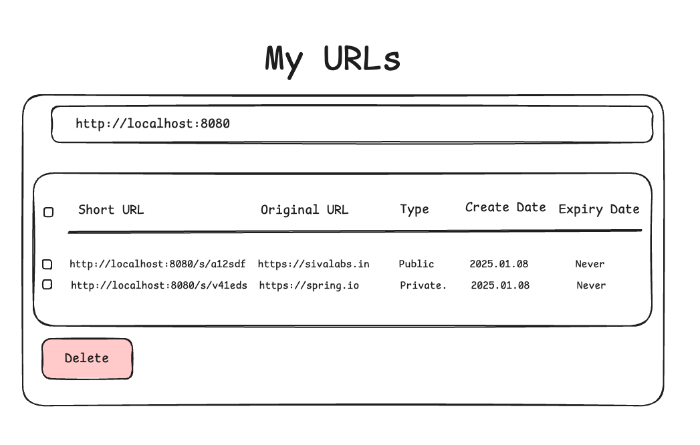
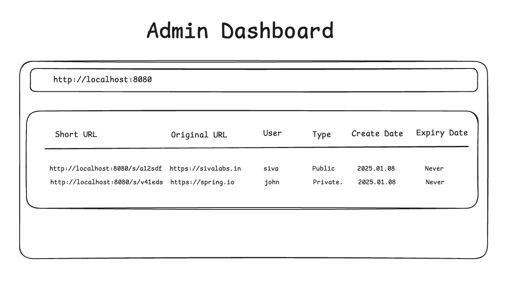
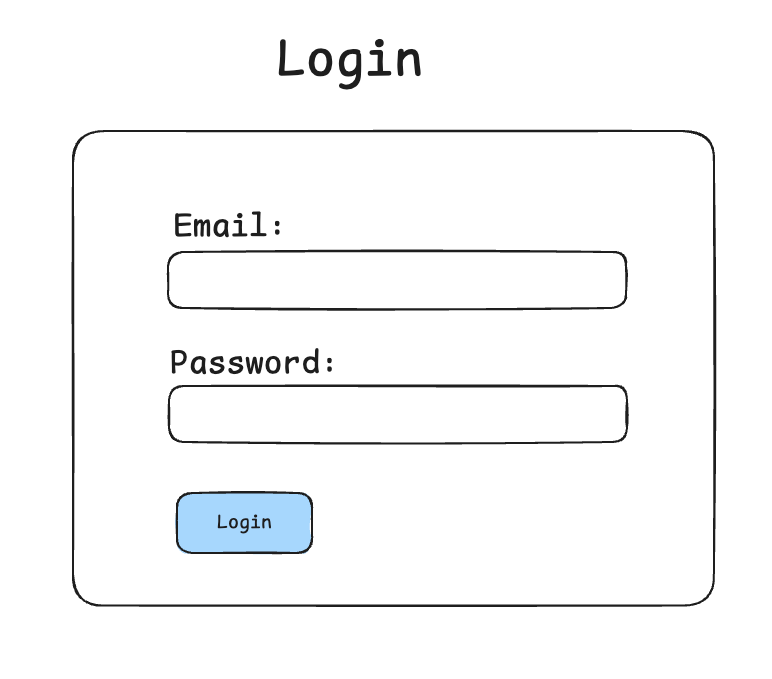
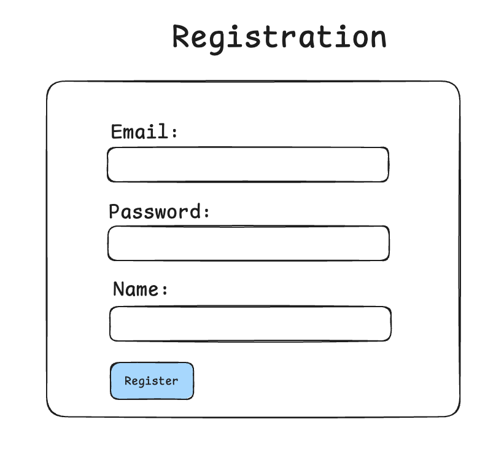

# Spring Boot URL Shortener - Part 1

## Tech Stack
* Spring Boot
* Spring Security
* JdbcClient / Spring Data JPA
* PostgreSQL
* FlywayDb Migrations
* Thymeleaf
* Bootstrap CSS

## What are you going to learn?
* WebApp
    * Displaying Data
    * Form Submission
    * Validations
    * Handling Exceptions

* Database
    * CRUD operations
    * DB migrations using Flyway
    * Pagination
    * Open Session In View Filter
    * Handling LazyLoadingException

* Security
    * Login, Registration
    * Role Based Access Control
    * Get current user details

## Screenshots

### Home Page

### My URLs Page

### Admin Dashboard Page

### Login Page

### Registration Page

